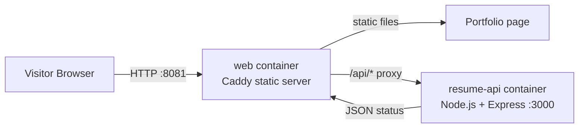

# Portfolio Docker Compose Lab

โปรเจกต์ Portfolio ขนาดเล็กที่ใช้ 2 containers ทำงานร่วมกัน เพื่อสาธิตการใช้งาน Dockerfile และ Docker Compose

## ระบบ

- `web`: ใช้ Caddy แสดงไฟล์ `src/index.html` และส่งต่อ request `/api/*` ไปยัง `resume-api`
- `resume-api`: image Node.js ที่สร้างจาก `backend/Dockerfile` ทำหน้าที่ส่งข้อมูล Portfolio ในรูปแบบ JSON
- `system-diagram.md`: ไฟล์ System Diagram ที่เขียนด้วย Mermaid Markdown

## System Diagram



## การทำงานของระบบ

```bash
docker compose build --no-cache
docker compose up
```

คำสั่งแรกใช้ build image ใหม่โดยไม่ใช้ cache และคำสั่งที่สองใช้เริ่มต้นระบบ

เปิดเว็บไซต์ที่ <http://localhost:8081> โดยข้อความด้านล่างของหน้าเว็บจะถูกโหลดมาจาก API container

ทดสอบ API จากเครื่อง host:

```bash
curl http://localhost:8081/api/status
```

หยุดระบบด้วย `Ctrl+C` หรือใช้คำสั่งต่อไปนี้:

```bash
docker compose down
```
