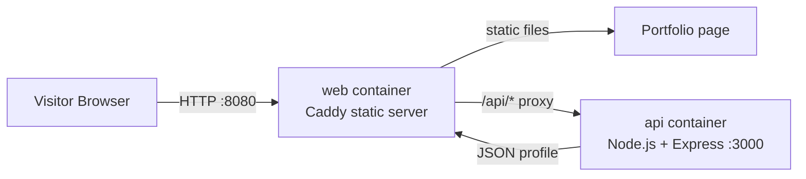

# Portfolio Lab System Diagram

This diagram shows the request flow between the two Compose containers.

```mermaid
flowchart LR
    Browser["Visitor Browser"] -->|HTTP :8080| Web["web container\nCaddy static server"]
    Web -->|static files| Page["Portfolio page"]
    Web -->|/api/* proxy| API["api container\nNode.js + Express :3000"]
    API -->|JSON profile| Web
```
